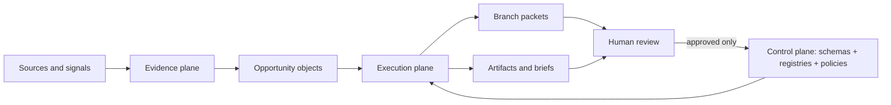

# Data Flow Map

## Summary

The kernel separates truth, evidence, and execution.

- **Control plane:** schemas, registries, governance, canonical profile, and competencies.
- **Evidence plane:** source logs, evidence packets, and runtime outputs.
- **Execution plane:** local CLI commands that create branch packets, briefs, and intake records.

## Object flow

```text
raw source or opportunity signal
-> source log entry
-> evidence object
-> opportunity object
-> branch contract
-> generated work product
-> review note or promotion decision
-> canonical update, if approved
```

## Mermaid flowchart



## Current objects entering the repo

- resume summary evidence
- role descriptions
- dissertation-to-career findings
- portfolio project ideas
- networking signals
- branch-specific strategy notes

## Current objects leaving the repo

- branch packets
- job-fit maps
- executive briefs
- portfolio project specs
- outreach plans
- artifact requests

## Validation gates

The validator checks that:

- required files exist
- registries point to real files
- schema files parse as JSON
- registered example objects include required fields
- branch registry entries point to real branch contracts
- canonical paths are not missing

## Boundary

Runtime files under `data/runtime/` are generated outputs. They can inform future updates, but they are not canonical until reviewed and promoted.
