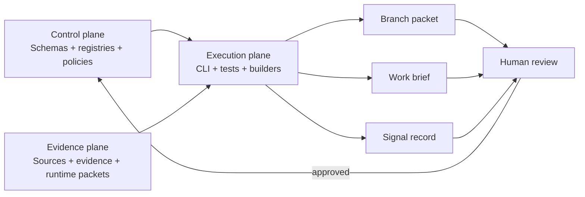

# Architecture

The kernel adapts the three-plane pattern from the reference repositories into a single practical repository for Kirsten's work.

## Plane 1: Control plane

The control plane defines meaning and authority.

It includes:

- schemas
- registries
- policies
- canonical profile facts
- competency maps
- source-of-truth rules

The control plane should change slowly and deliberately.

## Plane 2: Evidence plane

The evidence plane stores grounded support for claims and decisions.

It includes:

- resume evidence
- source logs
- source-linked claim support
- generated runtime packets
- future decision records

Evidence can be added often, but it should remain traceable.

## Plane 3: Execution plane

The execution plane turns controlled inputs into outputs.

It includes:

- CLI commands
- scripts
- tests
- GitHub Actions
- branch builders
- brief builders

The execution plane can produce drafts, but it cannot promote drafts into canonical truth without review.

## Mermaid architecture

## Branching model

A branch is a bounded workstream with its own strategy, artifacts, and evidence needs. Branches should inherit from the kernel rather than copy it.

Examples:

- `phd-outreach`
- `dean-of-students`
- `student-affairs-avp`
- `dissertation-translation`
- `portfolio-projects`
- `networking-strategy`
